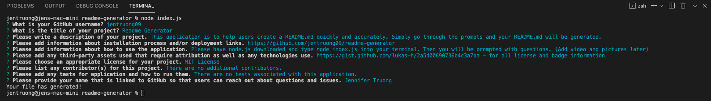

  # README Generator 

   

  ## Project Description

  This application is to help users create a README.md quickly and accurately. Simply go through the prompts and your README.md will be generated.

   

  ## Table of Contents
  - [Deployment](#installation)
  - [Usage](#usage)
  - [Credits](#credits)
  - [License](#license)
  - [Contributors](#contributors)
  - [Tests](#tests)
  - [Questions](#questions)

   

  ## Deployment
  

  [Repository](https://github.com/jentruong09/readme-generator)

   

  ## Usage
  Please have node.js downloaded and type node index.js into your terminal. Then you will be prompted with questions as the image and video below:

  

  [Link to Video](https://youtu.be/bLqTuavoDi8)

   

  ## Credits
  This project is made possible by:

  [Markdown License badges](https://gist.github.com/lukas-h/2a5d00690736b4c3a7ba) - for all license and badge information 

  [README Guide](https://coding-boot-camp.github.io/full-stack/github/professional-readme-guide/)

   

  ## License 
  
  
  This application uses the MIT License

  Copyright 2022 Jennifer Truong

  Permission is hereby granted, free of charge, to any person obtaining a copy of this software and associated documentation files (the "Software"), to deal in the Software without restriction, including without limitation the rights to use, copy, modify, merge, publish, distribute, sublicense, and/or sell copies of the Software, and to permit persons to whom the Software is furnished to do so, subject to the following conditions:

  The above copyright notice and this permission notice shall be included in all copies or substantial portions of the Software.

  THE SOFTWARE IS PROVIDED "AS IS", WITHOUT WARRANTY OF ANY KIND, EXPRESS OR IMPLIED, INCLUDING BUT NOT LIMITED TO THE WARRANTIES OF MERCHANTABILITY, FITNESS FOR A PARTICULAR PURPOSE AND NONINFRINGEMENT. IN NO EVENT SHALL THE AUTHORS OR COPYRIGHT HOLDERS BE LIABLE FOR ANY CLAIM, DAMAGES OR OTHER LIABILITY, WHETHER IN AN ACTION OF CONTRACT, TORT OR OTHERWISE, ARISING FROM, OUT OF OR IN CONNECTION WITH THE SOFTWARE OR THE USE OR OTHER DEALINGS IN THE SOFTWARE.

  For more information, please visit: https://opensource.org/licenses/MIT

   

  ## Questions
  If you have any questions, please reach out to a contributor via GitHub:

  [Jennifer Truong](https://github.com/jentruong09)
  

